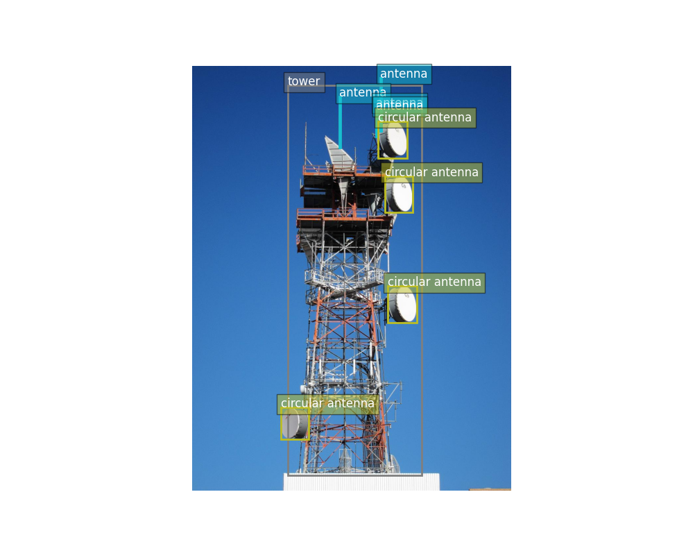

# Zero Shot Object Detection
A repository to detect objects from images using Zero shot inference

## Execution
1. Clone the respository
2. Copy your data into the data folder, for instance your image
3. Modify the config.yaml file accordingly    

    Change the filepath of your image, modify the threshold to only get objects with a high score.

4. Execute the main.py module
```python
python main.py
```
## Outputs
The script will save the output of the object detection into results/results.csv, which will look like this:
```.csv
label,score,box
antenna,0.486,"[571.81103515625, 34.781707763671875, 576.377685546875, 198.4154510498047]"
antenna,0.435,"[446.92889404296875, 92.5588607788086, 451.5504455566406, 249.06173706054688]"
antenna,0.398,"[558.699462890625, 123.37767028808594, 562.3655395507812, 214.18060302734375]"
antenna,0.386,"[559.2413940429688, 132.77801513671875, 562.743408203125, 214.75433349609375]"
circular antenna,0.367,"[565.5391845703125, 167.64007568359375, 653.0719604492188, 279.6972961425781]"
circular antenna,0.355,"[585.2584838867188, 334.6128234863281, 670.30126953125, 445.67120361328125]"
tower,0.764,"[289.7002868652344, 58.60854721069336, 697.9633178710938, 1246.66259765625]"
circular antenna,0.501,"[593.6900634765625, 668.8366088867188, 684.042724609375, 781.7091674804688]"
circular antenna,0.469,"[268.84564208984375, 1039.5875244140625, 354.102783203125, 1136.4930419921875]"

```

It will also generate an image superimposed with the objects detected, like this one:


On the terminal, it will display the number of objects found for each class.
```
These are the number unique objects detected above the threshold of 0.3.
label
antenna             4
circular antenna    4
tower               1
```
## Model details:
The OWLv2 model (short for Open-World Localization) was proposed in Scaling Open-Vocabulary Object Detection by Matthias Minderer, Alexey Gritsenko, Neil Houlsby. OWLv2, like OWL-ViT, is a zero-shot text-conditioned object detection model that can be used to query an image with one or multiple text queries.

The model uses CLIP as its multi-modal backbone, with a ViT-like Transformer to get visual features and a causal language model to get the text features. To use CLIP for detection, OWL-ViT removes the final token pooling layer of the vision model and attaches a lightweight classification and box head to each transformer output token. Open-vocabulary classification is enabled by replacing the fixed classification layer weights with the class-name embeddings obtained from the text model. The authors first train CLIP from scratch and fine-tune it end-to-end with the classification and box heads on standard detection datasets using a bipartite matching loss. One or multiple text queries per image can be used to perform zero-shot text-conditioned object detection. 

Read more under:
https://huggingface.co/google/owlv2-large-patch14-finetuned

